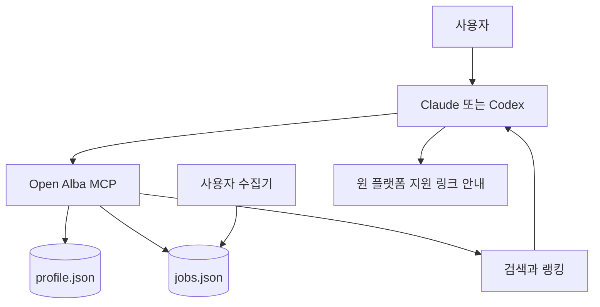
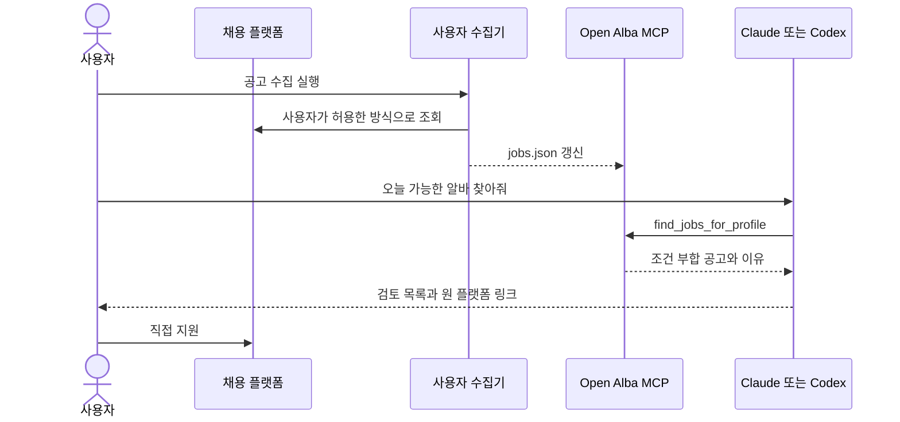

# [PRD] Open Alba MCP - 로컬 우선 알바 공고 자동 검색 커넥터

**작성일**: 05월 26일

**작성자**: Codex

**상태**: 초안

---

## 0. 이니셔티브 개요

> 💡 **핵심 목표**
> Open Alba MCP는 사용자가 각자 수집한 알바 공고 데이터를 로컬 MCP 서버로 연결하여, Claude/Codex 같은 AI 클라이언트에서 위치, 시간, 시급, 직무 조건에 맞는 공고를 자동으로 찾게 한다.

### 핵심 가치

1. **Local-first**: 중앙 플랫폼이 공고와 사용자 데이터를 보유하지 않는다.
2. **BYO Source**: 사용자가 각자 이용 가능한 채용 플랫폼, CSV, JSON, 내부 API에서 공고를 가져온다.
3. **Agent-native**: 별도 화면보다 Claude/Codex 앱에서 검색, 요약, 비교, 지원 초안 작성을 수행한다.
4. **Apply-at-source**: 지원과 연락은 원 채용 플랫폼에서 진행한다.
5. **Low-liability**: 에스크로, 정산, 계약, 자동 지원을 제품 범위에서 제외한다.

### Phase 로드맵

| Phase | 목표 | 포함 US |
|-------|------|---------|
| **Phase 1** (1주) | 로컬 공고 인덱스와 MCP 검색 MVP | US-1 ~ US-6 |
| **Phase 2** (2주) | 조건 프로필, 주기 검색, 신규 공고 탐지 | US-7 ~ US-11 |
| **Phase 3** (미정) | 소스 어댑터 생태계와 안전 정책 강화 | US-12 ~ US-16 |

---

## 1. 문제 배경

### 시장 현황

* 알바 공고는 여러 채용 플랫폼에 흩어져 있고, 플랫폼마다 검색 필터와 알림 방식이 다르다.
* 단기 알바는 위치, 시작 시간, 시급, 직무 조건이 조금만 달라도 사용 가능성이 크게 달라진다.
* 사용자는 여러 앱을 반복해서 열고 같은 조건을 수동으로 검색해야 한다.
* AI 클라이언트 사용이 늘면서 사용자는 별도 앱보다 대화형 작업 환경에서 개인 조건 기반 검색을 처리하려는 니즈가 있다.

### 타겟 조직의 어려움

* **개인 사용자**: 여러 채용 플랫폼을 오가며 같은 조건을 반복 검색한다.
* **소규모 커뮤니티 운영자**: 커뮤니티 구성원에게 맞는 공고를 공유하고 싶지만 중앙 서버 운영과 개인정보 보유 부담이 크다.
* **실험 개발자**: 특정 채용 플랫폼에 종속되지 않는 공고 검색 자동화 도구를 만들고 싶지만 표준 포맷과 MCP 연결면이 없다.

### 기술적 기회와 시장 공백

* MCP를 통해 Claude, Codex, Cursor 등 AI 클라이언트가 로컬 도구를 직접 호출할 수 있다.
* 사용자의 로컬 파일, 로컬 DB, 개인 API 토큰을 중앙 서버 없이 활용할 수 있다.
* 해외 정규직 채용 공고 MCP는 존재하지만, 한국 알바/단기근무의 위치, 시간, 시급 중심 조건에 특화된 로컬 표준은 부족하다.

---

## 2. 문제 인식

### 타겟 사용자

1. **알바 탐색 사용자** - 자기 위치와 시간표에 맞는 단기 공고를 빠르게 찾고 싶은 개인.
2. **AI 클라이언트 사용자** - Claude/Codex 앱에서 공고 검색과 비교를 처리하고 싶은 사용자.
3. **어댑터 개발자** - 특정 채용 플랫폼, 커뮤니티, CSV, 내부 API를 Open Alba 포맷으로 연결하려는 개발자.

### 핵심 문제

#### 문제 1: 조건 검색이 반복적이고 분산되어 있음

* **상황**: 사용자는 여러 알바 채용 앱과 지역 커뮤니티를 각각 검색한다.
* **어려움**: 같은 위치, 같은 시간, 같은 시급 기준을 여러 앱에 반복 입력한다.
* **사례**: "오늘 저녁 6시 이후 강남역 근처 시급 12,000원 이상만 보고 싶은데 매번 다시 검색해야 한다."

#### 문제 2: 단기 알바는 거리와 시간 조건이 핵심인데 비교가 어렵다

* **상황**: 공고마다 주소, 역세권, 시작 시간, 근무 시간이 다르게 표시된다.
* **어려움**: 사용자가 실제 이동 가능성과 개인 일정 적합도를 직접 계산해야 한다.
* **사례**: "시급은 높은데 이동 시간이 길면 실제로는 손해인지 바로 판단하기 어렵다."

#### 문제 3: 중앙 플랫폼화는 운영 부담이 크다

* **상황**: 직접 공고를 운영하면 개인정보, 위치정보, 직업정보제공, 분쟁, 정산 책임이 커진다.
* **어려움**: 초기 실험 단계에서 법무, 보안, 운영 체계를 모두 갖추기 어렵다.
* **사례**: "공고를 직접 중개하지 않고도 검색 자동화 가치만 검증하고 싶다."

#### 문제 4: 자동 지원은 위험하지만 자동 검색은 유용함

* **상황**: AI가 지원까지 자동으로 수행하면 플랫폼 약관, 오지원, 개인정보 입력 문제가 생긴다.
* **어려움**: 사용자는 편의를 원하지만 최종 지원은 본인이 통제해야 한다.
* **사례**: "괜찮은 공고를 찾아주고 지원 문구 초안만 만들어주면, 실제 지원은 내가 원 플랫폼에서 하겠다."

### 근본 원인

1. **표준 포맷 부재**: 플랫폼별 공고 구조가 달라 통합 검색이 어렵다.
2. **사용자 조건의 비정형성**: 위치, 시간, 임금, 직무 선호가 자연어와 개인 맥락으로 존재한다.
3. **중앙 서버 리스크**: 공고와 위치 데이터를 중앙에 모으면 운영 책임이 커진다.
4. **AI 클라이언트 연결면 부족**: 공고 검색 결과를 에이전트가 구조적으로 호출할 수 있는 MCP 도구가 부족하다.

---

## 3. 해결 방안

### 제품 개요

* Open Alba MCP는 사용자가 로컬에 보관한 알바 공고 데이터와 개인 조건 프로필을 MCP 도구로 노출하는 로컬 서버입니다.
* 제품은 공고 수집, 정규화, 검색, 추천 이유 설명, 지원 초안 작성을 지원하지만, 실제 지원, 연락, 계약, 정산, 에스크로는 수행하지 않습니다.

### 차별점

| 항목 | 기존 방식 | Open Alba MCP |
|------|----------|---------------|
| 데이터 보관 | 플랫폼 중앙 서버 또는 각 앱 내부 | 사용자 로컬 파일 또는 로컬 DB |
| 사용 화면 | 전용 웹앱 또는 모바일앱 | Claude/Codex 등 MCP 클라이언트 |
| 공고 출처 | 특정 플랫폼 종속 | BYO source와 어댑터 계약 |
| 핵심 조건 | 직무 키워드 중심 | 위치, 시간, 시급, 단기성 중심 |
| 지원 방식 | 플랫폼 내부 지원 | 원 채용 플랫폼에서 사용자가 직접 지원 |
| 운영 책임 | 플랫폼 중개/정산 책임 확대 | 검색 도구 제공으로 범위 제한 |

### 핵심 기능

#### 1. 로컬 공고 인덱스

* JSON/CSV로 저장된 공고를 표준 Open Alba Job 포맷으로 로드한다.
* 공고 ID, 출처, 원문 URL, 지원 URL, 주소, 좌표, 시간, 시급, 태그를 보존한다.
* 중복 공고를 출처, 원문 ID, 제목/회사/시간 키로 식별한다.

#### 2. 조건 기반 검색

* 위치 반경, 최소 시급, 직무 카테고리, 시작 시간, 근무 시간으로 공고를 필터링한다.
* Haversine 거리 계산으로 사용자 위치와 공고 위치의 대략적 거리를 산출한다.
* 검색 결과는 원 플랫폼 지원 URL을 포함한다.

#### 3. 개인 프로필 기반 추천

* 사용자는 선호 지역, 최대 이동 거리, 가능 시간대, 최소 시급, 선호 직무를 프로필로 정의한다.
* MCP 도구는 프로필에 맞는 공고를 점수화하고 추천 이유를 설명한다.
* 추천 결과는 자동 지원이 아니라 검토 목록으로 제공한다.

#### 4. 주기 검색과 신규 공고 탐지

* 사용자는 외부 수집기나 cron으로 공고 파일을 주기 갱신한다.
* 서버는 최근 조회 이후 신규 공고와 조건 부합 공고를 구분한다.
* 결과는 Claude/Codex가 읽기 쉬운 요약으로 반환한다.

#### 5. 안전한 어댑터 계약

* 본 패키지는 특정 채용 플랫폼의 비공식 스크래퍼를 기본 제공하지 않는다.
* 어댑터는 Open Alba Job 포맷으로 출력하는 별도 모듈로 분리한다.
* 각 사용자는 본인이 접근 권한과 이용 조건을 확인한 데이터 소스만 연결한다.

### 기술 접근 방식

**시스템 아키텍처**:

**핵심 기술 요소**:

* MCP stdio server: Claude/Codex 앱이 로컬 도구를 호출하는 기본 실행면.
* Open Alba Job schema: 공고 소스와 관계없이 동일하게 검색 가능한 표준 데이터 구조.
* Local profile: 개인 위치와 조건을 중앙 서버 없이 저장.
* Adapter contract: 채용 플랫폼별 수집기를 분리하기 위한 출력 계약.
* Safety boundary: 자동 지원, 자동 연락, 결제, 정산, 에스크로 제외.

### 사용자 경험 플로우

---

## 4. 성공 지표

### 핵심 지표

| 지표 | 현재 | 목표 | 측정 방법 |
|------|------|------|-----------|
| MCP 검색 성공률 | 0% | 로컬 샘플 기준 95% 이상 | smoke test |
| 조건 부합 추천 정확도 | 미측정 | 사용자 검토 기준 70% 이상 | 수동 라벨링 |
| 설치 후 첫 검색 시간 | 미측정 | 10분 이내 | 신규 사용자 타임트라이얼 |

### 제품 지표

* 샘플 데이터 기준 `search_jobs` 응답 시간: 1초 이내
* 동일 공고 중복 탐지율: 샘플 중복 케이스 90% 이상
* 추천 결과 설명 포함률: 100%
* 원 플랫폼 지원 URL 포함률: 95% 이상

### 비즈니스 지표

* 공개 저장소 star 또는 fork: 초기 4주 30개 이상
* 외부 어댑터 PR 또는 이슈: 초기 8주 3건 이상
* 실제 사용자 반복 실행: 초기 4주 5명 이상

---

## 5. 상위 요구사항

**전체 요구사항**: 사용자는 중앙 플랫폼 가입 없이 로컬에서 수집한 알바 공고를 MCP 클라이언트로 검색하고, 자기 조건에 맞는 공고를 원 플랫폼에서 직접 지원할 수 있어야 한다.

---

### Epic 1: 로컬 MCP 검색 MVP (Phase 1)

* **US-1**: 사용자는 MCP 클라이언트 연결을 위해 로컬 Open Alba MCP 서버를 실행할 수 있다.
* **US-2**: 사용자는 검색을 위해 Open Alba Job 포맷의 공고 파일을 로드할 수 있다.
* **US-3**: 사용자는 위치, 직무, 시급 조건으로 공고를 검색할 수 있다.
* **US-4**: 사용자는 특정 공고의 상세 정보와 원 플랫폼 지원 링크를 확인할 수 있다.
* **US-5**: 사용자는 추천 결과가 왜 적합한지 설명을 받을 수 있다.
* **US-6**: 사용자는 자동 지원 없이 지원 초안만 생성할 수 있다.

---

### Epic 2: 개인 조건과 주기 검색 (Phase 2)

* **US-7**: 사용자는 개인 위치, 가능 시간, 선호 직무, 최소 시급을 프로필로 저장할 수 있다.
* **US-8**: 사용자는 저장된 프로필 기준으로 조건에 맞는 공고를 자동 검색할 수 있다.
* **US-9**: 사용자는 최근 검색 이후 새로 들어온 공고만 확인할 수 있다.
* **US-10**: 사용자는 중복 공고를 제외한 결과만 받을 수 있다.
* **US-11**: 사용자는 검색 결과를 JSON 또는 Markdown 요약으로 받을 수 있다.

---

### Epic 3: 어댑터 생태계와 안전 정책 (Phase 3)

* **US-12**: 어댑터 개발자는 임의 소스의 공고를 Open Alba Job 포맷으로 변환할 수 있다.
* **US-13**: 사용자는 소스별 수집 권한과 이용 조건을 명시한 설정을 관리할 수 있다.
* **US-14**: 사용자는 금지 직무, 비정상 시급, 의심 공고를 경고로 확인할 수 있다.
* **US-15**: 사용자는 원 플랫폼 지원 원칙을 모든 결과에서 확인할 수 있다.
* **US-16**: 운영자는 공개 패키지에서 특정 플랫폼 비공식 수집기를 기본 번들하지 않도록 배포 정책을 유지할 수 있다.
